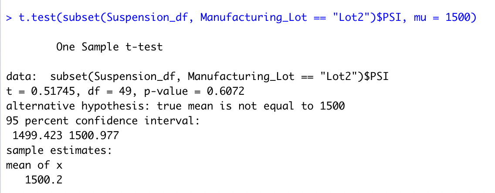

# MechaCar Statistical Analysis
The following report is our analysis on the production data from the manufacturing team at MechaCar

## Linear Regression to Predict MPG
Below please find a chart of our finding for the Linear Regression that predicts MPG.

 

Our research discovered that ground clearance and vehicle length gives us the best options for most fuel efficiency. Both of these variables showed a non-random amount of variance to the mpg values in the dataset.

The slope of the linear model is not considered to be zero because it's below the p-value.

This linear model predicts mpg of MechaCar prototypes effectively because it has a 71% predicatablitily that the mpg values will be correctly acheived.  

## Summary Statistics on Suspension Coils
Below are two charts the give a total summary (top) of all lots and a lot summary (bottom) of each lot.

It is our findings that the current manufacturing data meets the design specification for all manufacturing lots. The variance is 62.29% with a standard deviation of 7.89 
However, each lot individually does not meet the design specifications. Lots 1 and 2 are within tolerance with a variance of 0.97 for lot 1 and 7.46 for lot 2. Lot 3 has a variance of 170.28. This is completely unexcetable. 

## T-Tests on Suspecsion Coils

The above chart shows a p-value of 0.06 and is above the significance level of 0.05 percent. Therefore, we do not have sufficient evidence to reject the null hypothesis and we would state that the means are statistically similar. In other words, overall, all the lots are within the specifications of the factory settings for the coils. 

The above chart is for Lot 1. This shows a p-value of 1.0 and is above the significance level of 0.05 percent. Therefore, we do not have sufficient evidence to reject the null hypothesis, and we would state that the two means are statistically similar. In other words, Lot 1 is producing coils that are within the specifications of the factory settings for coils. 

This chart is for Lot 2. And it shows a p-value of 0.61 and is above the significance level of 0.05 percent. Therefore, we do not have sufficient evidence to reject the null hypothesis and we would state that the two means are statistically similar. In other words, Lot 2 is also producing coils that are within the specifications of the factory settings for coils.

The last chart above is for Lot 3. This shows a p-value of 0.04 and is below the significance level of 0.05 percent. Therefore, we have sufficient evidence to reject the null hypothesis and we would state that the two means are are statistically different. In other words, Lot 3 is producing coils that are not within the specifications of the factory settings and needs to be addressed to get them in complicance of factory settings. 

## Study Design: MechaCar vs Competition
To provide further analysis for MechaCar, I created a statistical study that will quantify how MechaCar performs against Ford and Toyota. In the study deign, I will examin metrics that would be of interest to consumers: safety rating and cost. 
I hyothesis that there is no difference in consumer choice when it comes to safety rating and cost of vehicle between manufacturers. The alternative hypothesis is that consumer choice is influenced, beyond random chance, by the safety rating and cost of vehicles between manufactorers. To test this hypothesis, I will use a Chi-Squared Statistical Test because the data is categorical with more than one independent and dependent variable. We are going to see is there is a difference in categorical (safety rating and cost) frequency between each manufacturing group (MechaCar, Ford, and Toyota). In order to run this test, I will need to create a contingency table, or a frquency table, for the data to be analized. Each unique value has an equal probablitity of being observed. And there is a minimum of five observed instance for every unique value. Additionally, we will be using a Multiple Linear Regression Test to see how much variablitily exisits between the manufactoring groups and safety ratings. And a second Multiple Linear Regression Test to see variablility between manufactoring groups and cost. 
